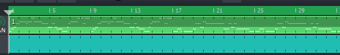

# Ambiences

Randomized ambience sounds!

## Based on Bhupali Raag (Major Pentatonic Scales)
S. N. | Name         | [Tempo](https://en.wikipedia.org/wiki/Tempo) | [TS](https://en.wikipedia.org/wiki/Time_signature)  | HH:MM | Main Instruments and Presets        | Download                              | Listen
------|--------------|-----|-------|-------|-----------------------------------|-------------------------------------|----------------------------------
1     | ambience-01  | 160 | 4 / 4 | 04:47 | TripleOscillator &gt; ResonantPad | [.mmpz](resources/ambience-01.mmpz) | [MIDI](resources/ambience-01.mid)
2     | ambience-02  | 160 | 4 / 4 | 04:47 | TripleOscillator &gt; ResonantPad | [.mmpz](resources/ambience-02.mmpz) | [MIDI](resources/ambience-02.mid)
3     | ambience-03  | 160 | 4 / 4 | 04:47 | TripleOscillator &gt; ResonantPad | [.mmpz](resources/ambience-03.mmpz) | [MIDI](resources/ambience-03.mid)
4     | ambience-04  | 160 | 4 / 4 | 04:47 | TripleOscillator &gt; ResonantPad | [.mmpz](resources/ambience-04.mmpz) | [MIDI](resources/ambience-04.mid)
5     | ambience-05  | 160 | 4 / 4 | 04:47 | TripleOscillator &gt; ResonantPad | [.mmpz](resources/ambience-05.mmpz) | [MIDI](resources/ambience-05.mid)
